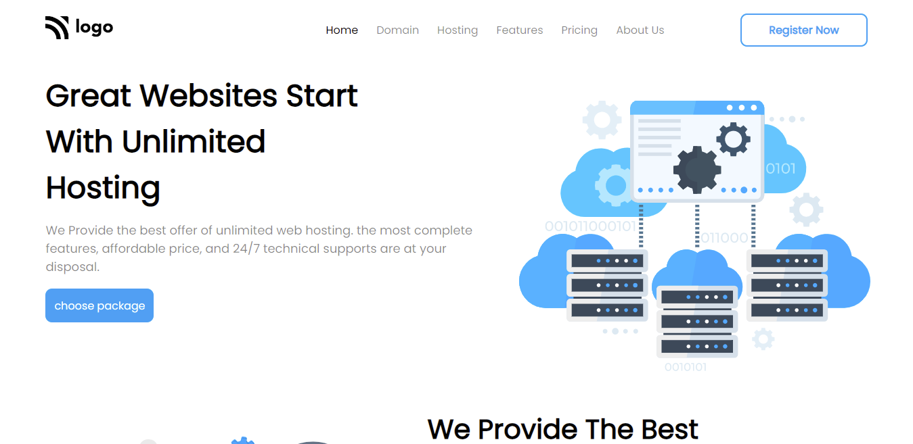
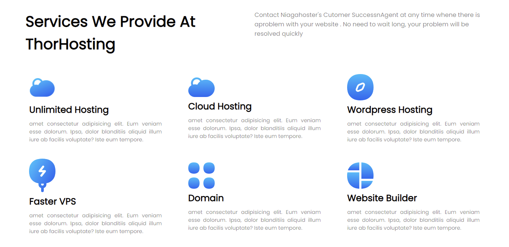
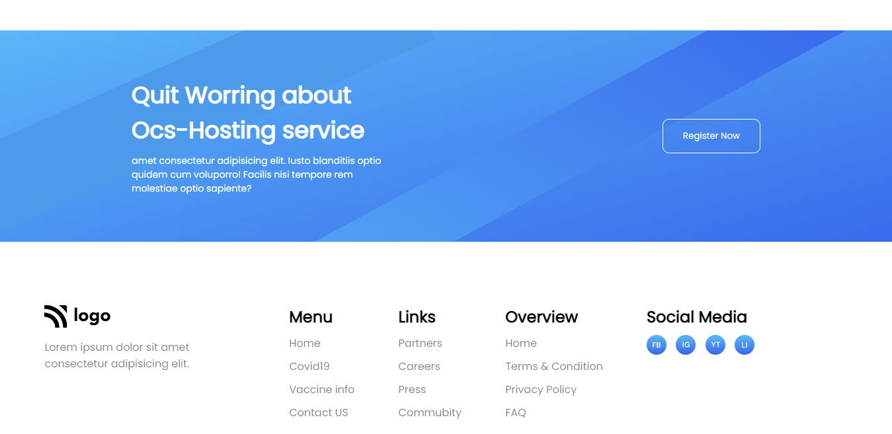

# Hosting-Landing-Page

## Project 11 [Live Link](https://hosting-landing-pages-11.netlify.app/)

- ### skills used in project
  - Learn css position, media query, flexbox, grid etc.
  - Learn to making background images responsive.
  - Total time taken 10hr to complete.
## Screenshot
### Desktop

